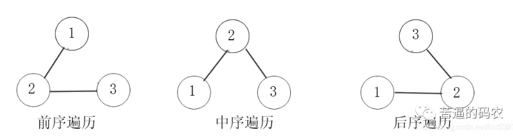

## 前序+中序/后序+中序构建二叉树

### 第一章 回顾

- 前序遍历：根 > 左 > 右
- 中序遍历：左 > 根 > 右
- 后序遍历：左 > 右 > 根




### 第二章 前序+中序

- 前序遍历第一位数字一定是这个二叉树的**根结点**

- 中序遍历中，根结点讲序列分为了左右两个区间，左边的区间是左子树的结点集合，右边的区间是右子树的结点集合

  ```java
   public TreeNode buildTree(int[] preorder, int[] inorder) {
          //用 HashMap 存储中序遍历，目的是查找方便。因为我们从前序遍历找到根节点后，还要寻找根节点在中序遍历的哪个位置
          HashMap<Integer, Integer> map = new HashMap<>();
          for(int i = 0; i < inorder.length; i++)
              map.put(inorder[i],i);
          return build(preorder, map, 0, preorder.length - 1, 0);
      }
  
      // 传入了五个参数，分别是：先序序列，中序序列
      // 先序序列的开始，先序序列的结束，中序序列的开始
      public TreeNode build(int[] preorder, HashMap<Integer,Integer> map, int preStart, int preEnd, int inStart){
          // 递归边界
          if(preEnd < preStart)
              return null;
          // 先序序列的第一位是根节点
          TreeNode root = new TreeNode(preorder[preStart]);
          //找到中序序列中，根节点的索引 index
          int rootIndex = map.get(root.val);
          // len 代表左子树的结点个数
          int len = rootIndex - inStart;
          // 左右子树的递归调用
          root.left = build(preorder, map, preStart + 1, preStart + len, inStart);
          root.right = build(preorder, map, preStart + len + 1, preEnd, rootIndex + 1);
          return root;
  ```

  

### 第三章 后序+中序

- 后序遍历的最后一位就是根节点

- 在中序遍历中，找到根结点的位置划分左右子树

  ```java
  public TreeNode buildTree(int[] inorder, int[] postorder) {
          HashMap<Integer, Integer> map = new HashMap<>();
          for(int i = 0; i < inorder.length; i++)
              map.put(inorder[i],i);
          return build(postorder, map, 0, postorder.length - 1, 0);
      }
  
      public TreeNode build(int[] postorder, HashMap<Integer,Integer> map, int postStart, int postEnd, int inStart){
          if(postEnd < postStart)
              return null;
          TreeNode root = new TreeNode(postorder[postEnd]);
          int rootIndex = map.get(root.val);
          int len = rootIndex - inStart;
          // 前面与先序遍历是一样的，仅仅是划分左右子树的地方不同。
          root.left = build(postorder, map, postStart, postStart + len - 1, inStart);
          root.right = build(postorder, map, postStart + len, postEnd - 1, rootIndex + 1);
          return root;
      }
  ```

  

