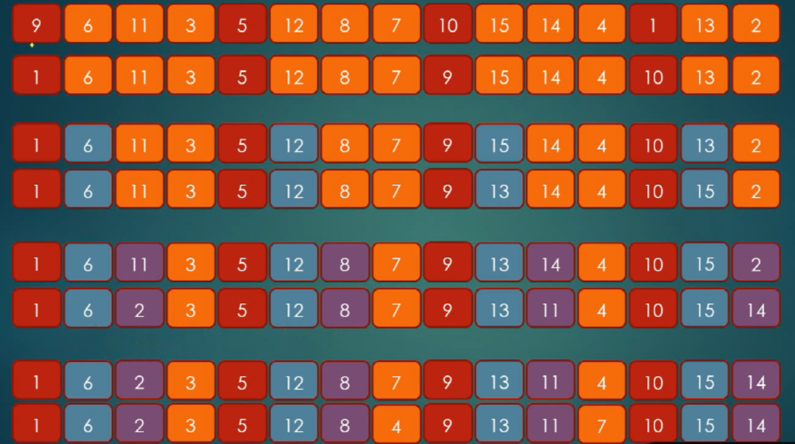
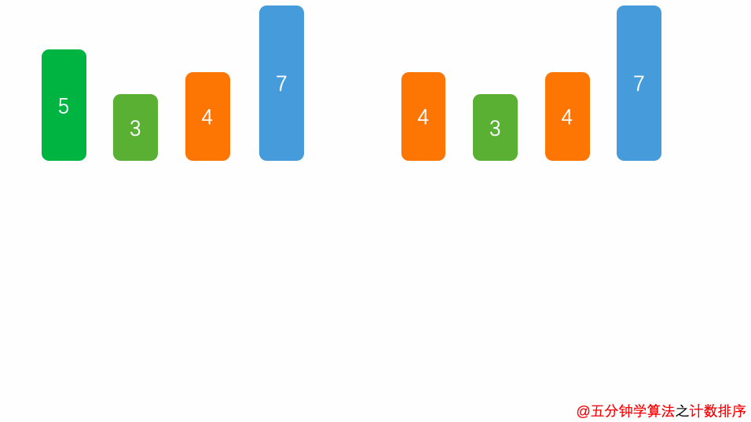

## 排序


### 1、冒泡排序

冒泡排序从序列的一端开始往另一端冒泡（向左或向右），依次比较相邻的两个数的大小（升序或降序），外层冒泡轮数，里层依次比较。


```java
//向右冒泡
public static void bubbleSort(int arr[]){
    for( int i = arr.length - 1; i > 0; i-- ){
        for(int j = 0; j < i; j++){
            int temp = 0;
            if(arr[j] > arr[j + 1])
                temp = arr[j];
                arr[j] = arr[j + 1];
                arr[j + 1] = temp;
        }
    }
}

//向左冒泡
public static void bubbleSort(int arr[]){
    for( int i = 0; i < arr.length - 1; i++ ){
        for(int j = arr.length - 1; j > i; j--){
            int temp = 0;
            if(arr[j] < arr[j - 1])
                temp = arr[j];
                arr[j] = arr[j - 1];
                arr[j - 1] = temp;
        }
    }
}
```

### 2、选择排序

首先找到数组中最值的元素，标记最值下标。将这个元素和数组的下一个元素比较通过后更新最值下标，再交换位置。如此循环直到整个数组排序完成。


```java
//升序
public static void selectSort(int arr[]){
    for( int i = 0;i < arr.length ; i++ ){
        int min = i;//最小元素的下标
        for(int j = i + 1;j < arr.length ; j++ ){
            if(arr[j] < arr[min]){
                min = j;//找最小值的下标
            }
        }
        //交换位置
        int temp = arr[i];
        arr[i] = arr[min];
        arr[min] = temp;
    }
}
//降序
public static void selectSort(int arr[]){
    for( int i = 0;i < arr.length ; i++ ){
        int max = i;//最大元素的下标
        for(int j = i + 1;j < arr.length ; j++ ){
            if(arr[j] > arr[max]){
                max = j;//找最大值的下标
            }
        }
        //交换位置
        int temp = arr[i];
        arr[i] = arr[max];
        arr[max] = temp;
    }
}
```

### 3、插入排序


```java
public static void insertSort(int arr[]){
	for (int i = 1; i < arr.length; i++) {
         for (int j = i; j > 0; j--) {
             if (arr[j] < arr[j-1])  
                //交换位置
       			int temp = arr[j];
        		arr[j] = arr[j-1];
        		arr[j-1] = temp;
         }
    }
}
```

### 4、希尔排序

插入排序对于大规模的乱序数组的时候效率是比较慢的，因为它每次只能将数据移动一位，希尔排序为了加快插入的速度，让数据移动的时候可以实现跳跃移动，节省了一部分的时间开支。





```java
public static void ShellSort(int arr[]){
    //区间
    int h = 1;
    while(h <= arr.length/3){
        h = h * 3 + 1;
    }
    for (int gap = h; gap > 0 ; gap = (gap-1)/3) {
        for (int i = gap; i < arr.length; i++) {
            for (int j = i; j > gap-1; j-=gap) {
                if (arr[j] < arr[j-gap])
                    //交换位置
                    int temp = arr[j];
                    arr[j] = arr[j-gap];
                    arr[j-gap] = temp;
            }
        }
    }
}
```

### 5、归并排序

归并字面上的意思是合并，归并算法的核心思想是分治法，就是将一个数组一刀切两半，递归切，直到切成单个元素，然后重新组装合并，单个元素合并成小数组，两个小数组合并成大数组，直到最终合并完成，排序完毕。


```java
public static void main(String[] args) {
    int[] arr = {1, 4, 7, 8, 3, 6, 9, 5, 56};
    sort(arr, 0, arr.length-1);
}

public static void sort(int[] arr, int left, int right){
    if (left == right) return;
    //分成两半
    int mid = left + (right - left)/2;
    //左边排序
    sort(arr, left, mid);
    //右边排序
    sort(arr, mid+1, right);
    //合并
    merge(arr,left,mid+1, right);
 }

public static void merge(int[] arr, int leftPtr, int rightPtr, int rightBound){
    int[] temp = new int[rightBound - leftPtr + 1];
    int mid = rightPtr - 1;

    int i = leftPtr;
    int j = rightPtr ;
    int k = 0;

    while (i <= mid && j <= rightBound) {
        temp[k++] = arr[i] < arr[j] ?  arr[i++] : arr[j++];
    }

    while(i <= mid) temp[k++] = arr[i++];
    while(j <= rightBound) temp[k++] = arr[j++];
    
	//temp数组复制到arr数组
    for (int m = 0; m < temp.length; m++) {
        arr[leftPtr + m] = temp[m];
    }
}
```


### 6、快速排序

快速排序的核心思想也是分治法，分而治之。它的实现方式是每次从序列中选出一个基准值，其他数依次和基准值做比较，比基准值大的放右边，比基准值小的放左边，然后再对左边和右边的两组数分别选出一个基准值，进行同样的比较移动，重复步骤，直到最后都变成单个元素，整个数组就成了有序的序列。


### 7、堆排序


### 8、计数排序



### 9、桶排序


### 10、基数排序


