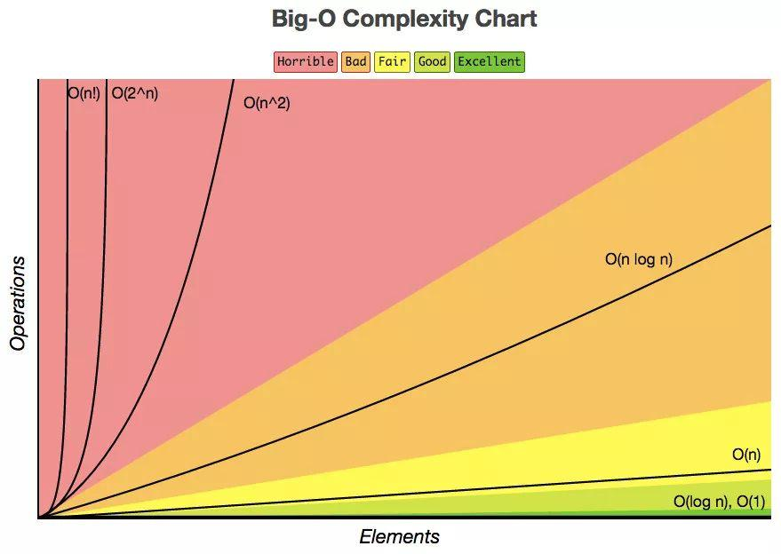
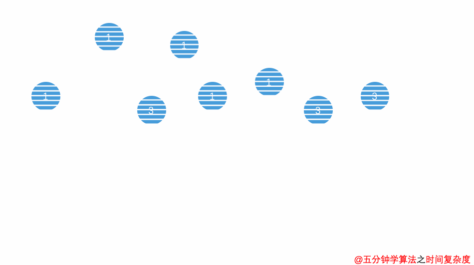

## 时间复杂度

算法（Algorithm）是指用来操作数据、解决程序问题的一组方法。对于同一个问题，使用不同的算法，也许最终得到的结果是一样的。那么我们应该如何去衡量不同算法之间的优劣呢？

主要还是从算法所占用的「时间」和「空间」两个维度去考量。

- 时间维度：是指执行当前算法所消耗的时间，我们通常用「时间复杂度」来描述。
- 空间维度：是指执行当前算法需要占用多少内存空间，我们通常用「空间复杂度」来描述。

### 大O表示法

 「大O符号表示法 」，即 **T(n) = O(f(n))**。

其中 n 表示数据规模 ，O(f(n))表示运行算法所需要执行的指令数，和f(n)成正比。

### 常见的时间复杂度量级



- #### 常数阶 O (1)

  

  无论代码执行了多少行，其他区域不会影响到操作，这个代码的时间复杂度都是O(1)

  ```java
  void swapTwoInts(int a, int b){
    	int temp = a;
    	a = b;
   	b = temp;
  }
  ```

- #### 线性阶 O (n)

  

  for循环里面的代码会执行 n 遍，因此它消耗的时间是随着 n 的变化而变化的，因此可以用O(n)来表示它的时间复杂度

  ```java
  int sum ( int n ){
     int ret = 0;
     for ( int i = 0; i <= n; i ++){
        ret += i;
     }
     return ret;
  }
  ```

- #### 平方阶 O (n²)

  

  当存在双重循环的时候，即把 O(n) 的代码再嵌套循环一遍，它的时间复杂度就是 O(n²) 

  ```java
  void selectionSort(int arr[],int n){
      for(int i = 0; i < n ; i++){
        int minIndex = i;
        for (int j = i + 1; j < n ; j++ )
          if (arr[j] < arr[minIndex])
              minIndex = j;
   
        swap ( arr[i], arr[minIndex]);
      }
  }
  ```

- #### 对数阶 O (logn)

  

  ```java
  int binarySearch( int arr[], int n, int target){
     int l = 0, r = n - 1;
     while ( l <= r) {
       int mid = l + (r - l) / 2;
       if (arr[mid] == target) return mid;
       if (arr[mid] > target ) r = mid - 1;
       else l = mid + 1;
    }
    return -1;
  }
  ```

  

- #### 线性对数阶O (nlogn)

  将时间复杂度为O(logn)的代码循环N遍的话，那么它的时间复杂度就是  n * O(logn)，也就是了O(nlogn)

  ```java
  void hello (){
    for( m = 1; m < n; m++){
      i = 1;
      while( i < n ){
          i = i * 2;
      }
     }
  }
  ```

  

### 最好、最坏情况时间复杂度 


```java
int find(int[] array, int n, int x) {
  for (  int i = 0; i < n; i++) {
    if (array[i] == x) {
        return i;
        break;
    }
  }
  return -1;
}
```

在这里当数组中第一个元素就是要找的 x 时，时间复杂度是 O(1)；而当最后一个元素才是 x 时，时间复杂度则是 O(n)。

最好情况时间复杂度就是在最理想情况下执行代码的时间复杂度，它的时间是最短的；最坏情况时间复杂度就是在最糟糕情况下执行代码的时间复杂度，它的时间是最长的。

### 平均情况时间复杂度 

最好、最坏时间复杂度反应的是极端条件下的复杂度，发生的概率不大，不能代表平均水平。那么为了更好的表示平均情况下的算法复杂度，就需要引入平均时间复杂度。平均情况时间复杂度可用代码在所有可能情况下执行次数的加权平均值表示。

还是以 `find` 函数为例，从概率的角度看， x 在数组中每一个位置的可能性是相同的，为 1 / n。那么，那么平均情况时间复杂度就可以计算：

> ( (1 + 2 + … + n) / n  + n )  /  2 = (3n + 1) / 4

`find` 函数的平均时间复杂度为 O(n)。

