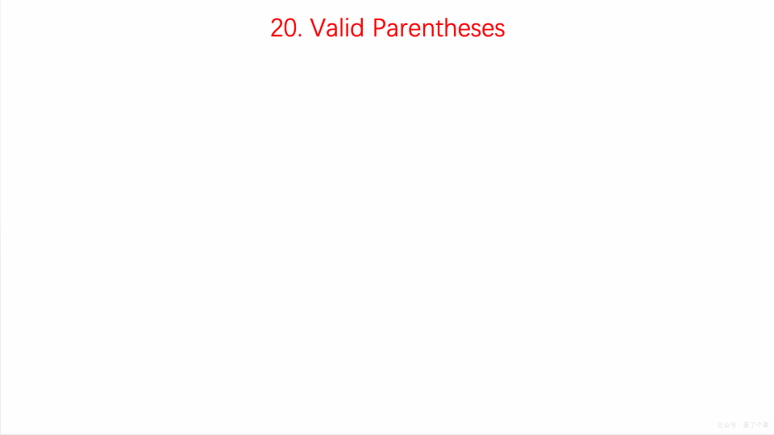
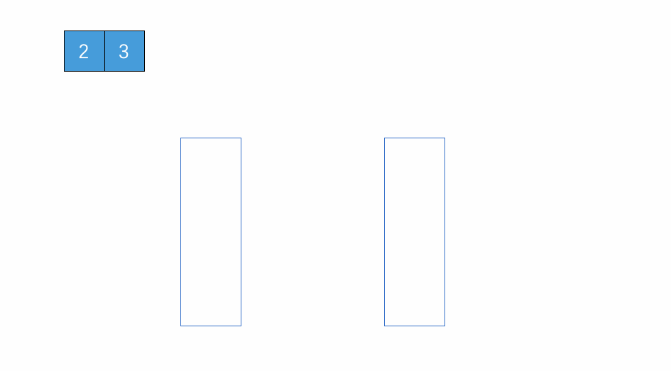

## 栈

#### 概述

#### 特点

先进后出，后进先出

#### 操作

入栈

出栈

#### 栈的实现

1. 顺序栈

   ```java
   public class ArrayStackDemo01 {
       private String[] items; //数组
       private int count; //栈中元素个数
       private int n; //栈的大小
   
       //初始化数组
       public ArrayStackDemo01(int count, int n) {
           this.items = new String[n];
           this.count = count;
           this.n = n;
       }
       /**
        * 功能:入栈
        * 说明:数组入栈的入口为数组的尾部
        * @param item :入栈数据元素
        * @return :是否入栈成功
        */
       public boolean push(String item){
           //数组空间满了，入栈失败
           if (count == n) return false;
           //将item放到count的位置
           items[count] = item;
           ++count;
           return true;
       }
       /**
        * 功能:出栈
        * @return :返回出栈元素
        */
       public String pop(){
           //栈为空，返回null
           if (count == 0) return null;
           //返回下表为count-1的数组元素
           String tmp = items[count - 1];
           //数组元素减一
           --count;
           //返回出栈数据元素
           return tmp;
       }
   }
   ```

2. 链式栈

#### 栈的性能

1. 时间复杂度
2. 空间复杂度
3. 栈的动态扩容

#### 栈的实际应用

#### 栈的面试题

##### 题目一：有效的括号

> 问题描述
>
> 给定一个只包括 '('，')'，'{'，'}'，'['，']' 的字符串，判断字符串是否有效

解题思路：

这道题让我们验证输入的字符串是否为括号字符串，包括大括号，中括号和小括号。这里我们使用**栈**。

- 遍历输入字符串
- 如果当前字符为左半边括号时，则将其压入栈中
- 如果遇到右半边括号时，**分类讨论：**
- 1）如栈不为空且为对应的左半边括号，则取出栈顶元素，继续循环  
- 2）若此时栈为空，则直接返回 false
- 3）若不为对应的左半边括号，反之返回 false()



```java
public boolean solution(String str){
        Stack<Character> stack = new Stack();
        char[] chars = str.toCharArray();
        for (char c : chars){
            if (stack.size() == 0){
                stack.push(c);
            }else if (isSym(stack.peek(),c)){
                stack.pop();
            }else {
                stack.push(c);
            }
        }
        return stack.size() == 0;
    }
    public boolean isSym(char top, char c){
        return  (top == '{' && c == '}' || top == '[' && c == ']' || top == '(' && c ==')');
    }
```

##### 题目二：用两个栈实现队列

> 问题描述:
>
> 用两个栈来实现一个队列，完成队列的 Push 和 Pop 操作



```java
	Stack<Integer> inStack = new Stack<>();
    Stack<Integer> outStack = new Stack<>();

    public void push(int node){
        inStack.push(node);
    }

    public int pop(){
        while (!inStack.isEmpty()) {
            outStack.push(inStack.pop());
        }

        if (outStack.isEmpty()){
            System.out.println("队列现在为空");
        }
        return outStack.pop();
    }
```

##### 题目三：栈的压入、弹出序列 

> 问题描述：
>
> 输入两个整数序列，第一个序列表示栈的压入顺序，请判断第二个序列是否为该栈的弹出顺序。假设压入栈的所有数字均不相等。例如序列  1，2，3，4，5 是某栈的压入顺序，序列  4，5，3，2，1是该压栈序列对应的一个弹出序列，但4，3，5，1，2就不可能是该压栈序列的弹出序列。（注意：这两个序列的长度是相等的）

```java
public boolean IsPopOrder(int[] pushSequence, int[] popSequence) {
    int n = pushSequence.length;
    Stack<Integer> stack = new Stack<>();
    for (int pushIndex = 0, popIndex = 0; pushIndex < n; pushIndex++) {
        stack.push(pushSequence[pushIndex]);
        while (popIndex < n && !stack.isEmpty() 
                && stack.peek() == popSequence[popIndex]) {
            stack.pop();
            popIndex++;
        }
    }
    return stack.isEmpty();
}
```

##### 题目四：包含min函数的栈

> 问题描述：
>
> 定义栈的数据结构，请在该类型中实现一个能够得到栈最小元素的 min 函数。
>
> 使用两个 stack，一个作为数据栈，另一个作为辅助栈。其中 **数据栈** 用于存储所有数据，而 **辅助栈** 用于存储最小值。

解题思路：

1. 入栈的时候：首先往空的数据栈里压入数字 3 ，此时 3 是最小值，所以把最小值压入辅助栈。接下来往数据栈里压入数字 4 。由于 4 大于之前的最小值，因此只要入数据栈，不需要压入辅助栈。
2. 出栈的时候：当数据栈和辅助栈的栈顶元素相同的时候，辅助栈的栈顶元素出栈。否则，数据栈的栈顶元素出栈。
3. 获得栈顶元素的时候：直接返回数据栈的栈顶元素。
4. 栈最小元素：直接返回辅助栈的栈顶元素。

```java
private Stack<Integer> dataStack = new Stack<>();
private Stack<Integer> minStack = new Stack<>();

public void push(int node) {
    dataStack.push(node);
    minStack.push(minStack.isEmpty() ? node : Math.min(minStack.peek(), node));
}

public void pop() {
    dataStack.pop();
    minStack.pop();
}

public int top() {
    return dataStack.peek();
}

public int min() {
    return minStack.peek();
}
```

